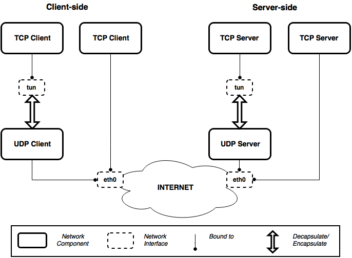

# copycat

**Network/Transport Protocol Comparison Tool (UDP vs TCP, Custom vs TCP, IPv4 vs IPv6)**

-------------

## Important Files

- src/copycat: binary executable
- copycat.cfg: configuration file
- dest.txt: destination file 
    each line should describe one destination with as followed
    IPv4:
	\<unique-source-port\> \<public-address\> \<private-address\>
    IPv6:
        \<unique-source-port\> \<public-address4\> \<private-address4\> \<public-address6\> \<private-address6\>

## Encapsulation modes

### UDP

Outer transport is UDP plus an optional layer 4.5 header (e.g.: SPUD, QUIC, PLUS) 
specified by raw bytes on client, size on server, both on peers.

### Non-UDP

Outer transport is custom and specified by raw bytes, protocol number
and size. Protocol number is used for socket filtering, except for TCP/UDP
that use source ports.

## Libs
- libglib-devel/libglib-dev (>= 1.2.10) or libglib-2.0-devel/libglib-2.0-dev
- libpcap

-------------
### Contact
@ekorian
